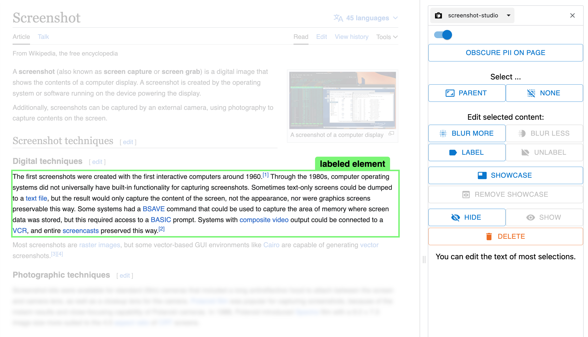

# Screenshot Studio

This Chrome extension is a toolkit for taking polished screenshots. Use it to edit a web page before screenshotting it.

**NOTE:** This is just a demo I built to pitch the project at Datadog. This version of the extension has limited functionality/performance and quite a few missing pieces, but it will work reasonably well if you build and install it locally and just use it on the included test site in a new tab. A copy of this codebase eventually became Pawparazzi, an internal screenshotting tool at Datadog.

## Features

In addition to making the text on the page editable, Screenshot Studio offers the following features:

- **obscure PII**: Anonymize email addresses and IP addresses.
- **blur**: Blur an image or text.
- **label**: Add a tab-style label to an element on the page.
- **showcase**: Fade everything on the page except for the selected element.
- **hide**: Hide the element while preserving the space it occupied.
- **delete**: Delete the element from the page.

## Acknowledgments

This extension was adapted from the [chrome-extension-boilerplate-react-vite template](https://github.com/Jonghakseo/chrome-extension-boilerplate-react-vite). Thank you!
